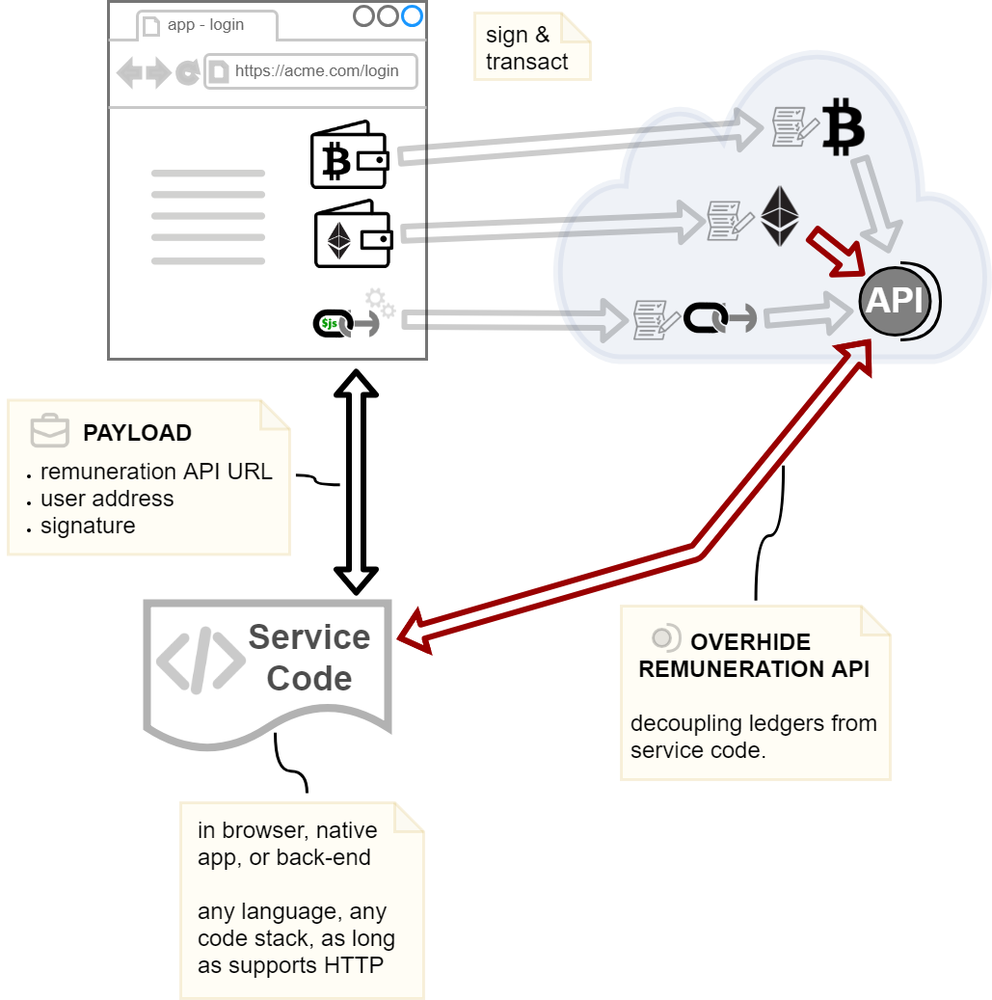

<p align="center"><a href="https://overhide.io"></a></p>

<p align="center"><a href="https://overhide.io">overhide.io</a></p><p style="width: 500px; margin: auto">A free and open-sourced (mostly) ecosystem of widgets, a front-end library, and back-end services &mdash; to make addition of "logins" and "in-app-purchases" (IAP) to your app as banal as possible.</p>

<hr/>

# overhide-bitcoin

[](https://circleci.com/gh/overhide/overhide-bitcoin)

[Bitcoin](https://www.bitcoin.org/) implementation of the [overhide.io](https://overhide.io) remuneration API.

Read about the API and play with it here:

**Testnet**: https://test.bitcoin.overhide.io/swagger.html

**Mainnet**: https://bitcoin.overhide.io/swagger.html

# About

The *overhide* system provides a suite of remuneration providers that implement the *overhide* remuenration API.  This repository is the Bitcoin *overhide* remuneration API provider.


*Figure 1: Shows the Bitcoin overhide-remuneration provider exposing the API.*

Read more about this suite of tools in support of ledger-based authorization flows by [playing around with the demos](https://www.npmjs.com/package/ledgers.js#getting-a-taste) and reading all about the [intention and motivation behind the system](https://overhide.io/2019/03/20/why.html).  

This [testnet](https://test.bitcoin.overhide.io/swagger.html) provider is used in the [demos](https://www.npmjs.com/package/ledgers.js#getting-a-taste).

# Quick Start

These steps assume Docker is available.

On Windows, the `npm run clean` script assumes *PowerShell* is setup and provisioned: runs with `@powershell`.  Ensure *PowerShell* is
setup or don't use this script.

Please review the *Configuration* section below.

Read the rest of this README for details.

## Quick Start With *overhide-bitcoin* In Docker Container

**Note:** the *npm run compose-dev* step (below) builds and runs a **for test only** opinionated container with settings and credentials suitable to be used for downstream testing (e.g. pegged to "rinkeby" testnet).

To build a non-test container see *Building Docker Image* section below.

1. `npm install --global --production windows-build-tools`
1. `npm install --no-optional` -- bring in dependencies
1. copy *./.npmrc.sample* to *./npmrc.dev*
1. edit *./.npmrc.dev*, but the defaults are mostly OK
1. `npm run compose-dev` -- build and start *overhide-bitcoin* Docker container
1. jump to "First Time DB Setup" section for the first-time DB setup
1. jump to "Database Evolutions" section, especially the "For Docker" subsection
1. your *oh-btc* container failed since your DB wasn't setup--now it is--find your *oh-btc* container name: `docker ps -a`; look for *oh-btc* with an "Exited" status.
1. `npm test` -- run tests against above
1. `point browser at http://editor.swagger.io/?url=http://localhost:8080/swagger.json` -- to use the API

From now on you'll need to use the following commands to stop/restart things:

* `npm run clean` -- stop *overhide-bitcoin* Docker container and remove image

## Quick Start With *overhide-bitcoin* Running Locally

1. `npm install --global --production windows-build-tools`
1. `npm install --no-optional` -- bring in dependencies
1. jump to "First Time DB Setup" section for the first-time DB setup
1. jump to "Database Evolutions" section, especially the "For Docker" subsection
1. `npm config set overhide-bitcoin:ETHERSCAN_KEY=...` -- replace '...' with your https://etherscan.io API key
1. `npm config set overhide-bitcoin:OH_ETH_PORT=8081` -- (optional) only necessary if you have a port conflict
1. `npm run start` -- start *overhide-bitcoin* on localhost
1. `npm test` -- in another terminal; run tests against above: 
1. `npm run set-auth` -- add user to authenticate against service
1. `point browser at http://editor.swagger.io/?url=http://localhost:8081/swagger.json` -- to use the API

# Security

The service uses `Authorization` headers with `Bearer ..` tokens for all endpoints.

By default, the `./main/js/lib/token.js` in this distro will check provided tokens against https://token.overhide.io/swagger.html (see `GET /validate`).  The default action takes place if a `SALT` value is left unconfigured.

If `SALT` is left unconfigured (default), your users must register for an API key with https://token.overhide.io.  The API key must be used to retrieve tokens as per https://token.overhide.io/swagger.html.

If you want to leverage the `SALT` config when standing up an instance of this service, you'll need to also stand-up your own instance of [overhide-client-auth](https://github.com/overhide/overhide-client-auth) service to furnish the tokens for this code (just remember to modify the `SALT` values in both services).

Alternatively, you can rework `./main/js/lib/token.js` to provide your own token-auth...  it's OSS.

The default service at https://bitcoin.overhide.io/swagger.html and https://rinkeby.bitcoin.overhide.io/swagger.html use tokens from the default token provider at https://token.overhide.io/register ([API](https://token.overhide.io/swagger.html)).

#   Configuration

All the configuration points for the app are listed in [.npmrc.sample](.npmrc.sample).

Configuration defaults in See [.npmrc.sample](.npmrc.sample) are reasonable only for testing.  

These *npm* configuration points are override-able with `npm config edit` or `npm config set` (see [npm-config](https://docs.npmjs.com/misc/config)).

For Docker compose environments configuration settings are taken from:

* *./.npmrc.dev* -- for local dev
* *./.npmrc.stage* -- for staging environment
* *./.npmrc.prod* -- for production environment

These files are not source controlled.  Create them using *./.npmrc.sample* as a template.

If an environment variable of the same name is made available, the environment variable's value precedes that
of the *npm config* value (*~/.npmrc* or *package.json*).

Some notable configuration points for *overhide-bitcoin*:

| *Configuration Point* | *Description* | *Sample Value* |
| --- | --- | --- |
| PORT | *overhide-bitcoin*'s port | 8080 |
| HOST | *overhide-bitcoin*'s host | localhost |
| BASE_URL | `host:port` *base URL* as used from outside (of load-balancer) to access service | localhost:8080
| DEBUG | see 'Logging' section below | overhide-bitcoin:*,-overhide-bitcoin:is-signature-valid:txs,-overhide-bitcoin:get-transactions:txs |
| SALT | Salt for bearer-token validation (see *Security* above) | c0c0nut |
| TOKEN_URL | Token validation URL (see *Security* above) | https://token.overhide.io/validate |
| RATE_LIMIT_WINDOW_MS | Duration of API rate limiting window (milliseconds) | 60000 |
| RATE_LIMIT_MAX_REQUESTS_PER_WINDOW | Number of API calls per rate limiting window | 30 |
| EXPECTED_CONFIRMATIONS | Number of confirmations before transaction is considered valid | 2 |
| IS_WORKER | Enable this on one (and only one) node -- runs worker processes that use up API limits | true |

# First Time DB Setup

All the DB connectivity configuration points assume that the DB and DB user are setup.

For localhost Docker, `psql` into the container:

```
npm run psql-dev
\c "oh-btc"
\dt
```


The 'adam' role and 'oh-btc' DB should already be created and connected to with the above command (as per `.npmrc.dev` environment passed into docker-compose).

If not, to manually create:

```
postgres=# create database "oh-btc";
postgres=# create user adam with encrypted password 'c0c0nut';
postgres=# grant all privileges on database "oh-btc" to adam;
```

Make sure to set the configuration points in your *.npmrc* appropriately.

Now you're ready to run database evolutions on the new database.

# Database Evolutions

There is a single Node file to check for and perform database evolutions.

Run it from the application node with `npm run db-evolve`.

It will evolve the database to whatever it needs to be for the particular application version.

The *main/js/lib/database.js* has an *init(..)* method which should check that the database is at the right evolution for that version of the app.

Consider currently running nodes before evolving: will they be able to run with the evolved DB?  Perhaps stop them all before evolving.

## Check

To check the database pre/post evolution (first time DB setup already done):

- log into DB
- list tables

```
npm run psql-dev
\dt oh-btc.*
```

If you need to select role and DB:

```
set role oh-btc;
\c oh-btc;
```

More commands:  https://gist.github.com/apolloclark/ea5466d5929e63043dcf

## Evolve

If running using Docker, jump into a container to run the evolution:

`docker run -it --rm --link postgres:postgres --network oh_default oh-btc /bin/sh`

Then run the evolution:

`npm run db-evolve`

# Logging

Logging is done via the https://www.npmjs.com/package/debug module.

Logging verbosity is controlled via the *DEBUG* environment variable or an *npm* configuration point of the same name.

Non-debug (error/warning/audit) logging is programmatically enabled by default despite setting of the *DEBUG* variable.  These are the "overhide-bitcoin-log" logs.

Setting *DEBUG* to "overhide-bitcoin:*" will enable all debug logging.  This will be very verbose.  It's likely desirable to target debug logging, e.g:

`npm config set overhide-bitcoin:DEBUG "overhide-bitcoin:*"`

# Notes on Running the Development Environment

To restart Node.js every time you change source files ensure to have *nodemon* installed:

`npm install -g nodemon`

Start Node.js using *nodemon*:

`nodemon --inspect main/js/overhide-bitcoin.js`

Or use the npm script:

`npm run dev`

## Configuration for Development

Default configuration in *package.json* is reasonable for development/testing.

You can override the configuration as per *Configuration* section above.

## Nodemon (Remote) Debugging

If you start *overhide-bitcoin* with `npm run dev` or *nodemon* from your command shell, you'll need to connect your development environment to this *node* process explicitly for remote debugging.

Note that `nodemon` above is started with `--inspect` to allow remote debugging.  

As an example, to remote-debug from *VSCode* use the following runtime configuration:

```
  "version": "0.2.0",
  "configurations": [
    {
      "type": "node",
      "request": "attach",
      "name": "Node: Nodemon",
      "processId": "${command:PickProcess}",
      "restart": true,
      "protocol": "inspector"
    }
  ]
```

Select the "Node: Nodemon" runtime configuration in *VSCode* and look for a "node" process matching the PID reported by the 'ctx_config' console log from *overhide-bitcoin*.

Once you see a "Debugger attached." message in your *nodemon* shell you're in business.

## Testing

`npm test` or run the Mocha/Chai tests in `./test/js/*` manually.

The tests aren't unit tests.  They do not start Node.js to run *overhide-bitcoin*; they expect the target device-under-test *overhide-bitcoin* to be running.

The tests should pass regardless of configuration being tested:

* a development environment started using `npm run start` or `npm run dev`
* a standalone Docker container started using `npm run compose-dev`

> The OH_ETH_HOST and OH_ETH_PORT configurations points may be used to point the tests at the target *overhide-bitcoin* for testing.

# Health Check -- Endpoint

This service furnishes metrics and a health check via the `status.json` endpoint.

Example run (with service running on localhost:8080):

```
curl http://localhost:8080/status.html
```
